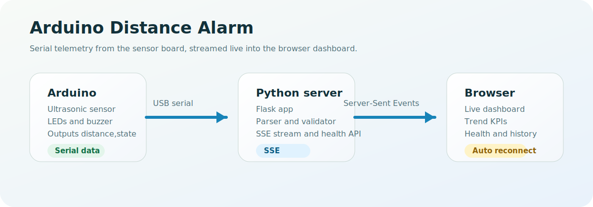

# Arduino Distance Alarm

<p align="center">
  <strong>Arduino serial telemetry, a Python dashboard, and live browser updates with SSE.</strong>
</p>

<p align="center">
  
  
  
  
</p>

<p align="center">
  
</p>

## Contents

- [Highlights](#highlights)
- [Why This Exists](#why-this-exists)
- [Current Workflow](#current-workflow)
- [Tech Stack](#tech-stack)
- [Requirements](#requirements)
- [Quick Start](#quick-start)
- [Usage](#usage)
- [Development](#development)
- [Roadmap](#roadmap)
- [License](#license)

## Highlights

| Feature | Description |
| --- | --- |
| Serial ingestion | Reads Arduino distance values over USB serial with strict parsing and fallback handling. |
| Live dashboard | Streams updates to the browser with Server-Sent Events and auto reconnect. |
| Diagnostics | Exposes `/health` and `/state` for quick troubleshooting. |
| Demo mode | Keeps the dashboard usable even without connected hardware. |
| Convenience scripts | `start.sh` and `stop.sh` simplify local usage on macOS and Linux. |
| Visual feedback | Shows status, thresholds, trends, and history in one place. |

## Why This Exists

This project rebuilds the original distance alarm into a more stable and inspectable stack:

Arduino sensor data -> Python backend -> SSE stream -> browser dashboard

The goal is to keep the hardware side simple while making the software side easier to debug, extend, and run locally.

## Current Workflow

1. Flash the Arduino sketch from `skechAdruinoAlarm/skechAdruinoAlarm.ino`.
2. Start the Python server with `./start.sh`.
3. Open the dashboard at `http://localhost:5050`.
4. Check `/health` and `/state` if live data does not appear.
5. Use `./stop.sh` to stop the server cleanly.

## Tech Stack

| Layer | Technology | Purpose |
| --- | --- | --- |
| Firmware | Arduino C++ sketch | Reads the ultrasonic sensor, drives LEDs, and prints serial telemetry. |
| Backend | Python 3 + Flask | Serves the dashboard, diagnostics, and SSE stream. |
| Serial I/O | pyserial | Detects and reads the Arduino serial connection. |
| Frontend | HTML, CSS, JavaScript | Renders the live control deck and charting UI. |
| Automation | Bash scripts | Provides start and stop helpers for local use. |

## Requirements

- Python 3.11 or newer
- `pip`
- `flask`
- `pyserial`
- An Arduino board with the included sketch
- Optional: `lsof` for the helper scripts

## Quick Start

```bash
cd /Users/johannesgrof/Projects/Private/Private-Projects/adruino-distance-alarm
python3 -m venv .venv
source .venv/bin/activate
pip install -r requirements.txt
./start.sh
```

The dashboard opens on:

```text
http://localhost:5050
```

## Usage

### Local server

```bash
python server.py
python server.py --demo
python server.py --list-ports
python server.py --serial-port /dev/cu.usbmodemXXXX --baud 9600
python server.py --http-port 5060
```

### Helper scripts

```bash
./start.sh
./start.sh demo
HTTP_PORT=5060 ./start.sh
./stop.sh
```

### Diagnostics

- `GET /health` returns mode, uptime, connection state, and the last error.
- `GET /state` returns the latest sample, recent history, and aggregate stats.
- `GET /events` provides the SSE stream for the browser dashboard.

## Development

The backend is intentionally small, so development stays lightweight:

```bash
python -m py_compile server.py
bash -n start.sh stop.sh
```

The Arduino sketch emits strict `distance,state` lines. The backend accepts the following formats:

- `distance,state`
- `distance;state`
- `distance`

## Roadmap

- Add automated Arduino build validation if a local toolchain is added later.
- Split the dashboard into smaller modules if the UI keeps growing.
- Add basic browser-side tests once the UI stabilizes.

## License

No license file is currently included in this repository.
